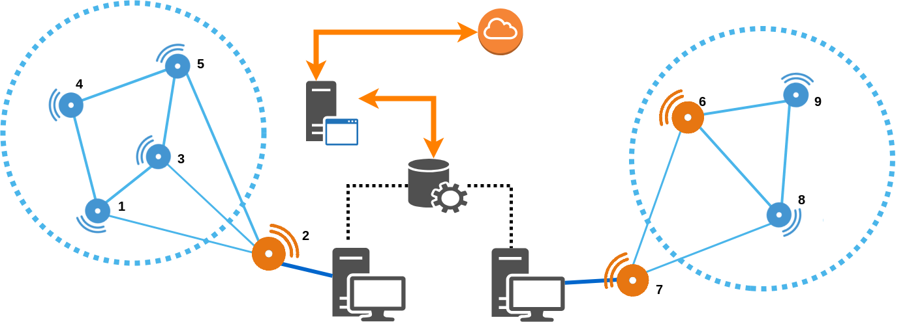

## SMART/WHIN IoT Project

### Description

SMART/WHIN IoT sensor project. Prototype of Mesh network implementation used for the demo on May, 1st 2018. This folder includes project source code for:
 * nRF52 board
 * STM32 board

Each project includes the following features:
 * Dynamic join of nodes (boundary and router nodes) to the mesh network. 
 * Read measurements from sensors (nitrate concentration & temperature) and forward them to the Gateway.
 * Scripts that collects readings from the boundary nodes and upload them to the Cloud Server.

Specific instruction for setup and run each project are in their respective subfolders.

### Future Work

 * Implement dynamic failures/leaves of nodes.
 * Scale the dynamic mesh network to more nodes (currently has been tested with 4 nodes).
 * Tweaks to the communication protocol.
 * Battery optimization.
 * Reevaluate the communication mecanism used to upload sensor readings to the cloud. Right now we are using a python script, but that requires a computer connected to the boundary node. Evaluate the possibility of using bluetooth/ANT or LoRaWAN instead.

### Demo

The demo setup follows the following arquitecture.

*Note. The STM32 boards are represented in orange. In both mesh networks, STM32 boards are used as boundary nodes to collect the sensos readings from the network and upload them to the cloud.*

### Colaborators

 * Edgardo Barsallo Yi
 * Heng Zhang
 * Xiaofan Jiang
